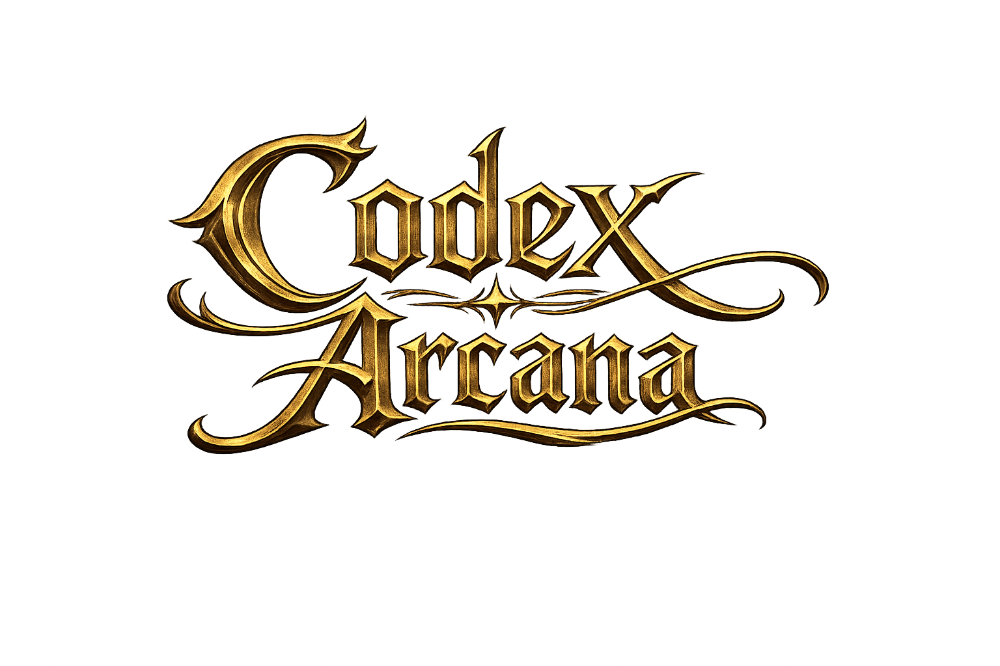

<p align="center">
  
</p>

<p align="center">
  <strong>Ein digitaler Begleiter für Abenteuer in Kreijor.</strong>
</p>

<p align="center">
  Charakterverwaltung · Regelautomatisierung · Ausrüstung · Magie · Entwicklung
</p>

<p align="center">
  <a href="README.md">English</a> · Deutsch
</p>

<p align="center">
  <a href="https://discord.gg/mRKwGSsPEG">
    
  </a>
  
  
  
  
</p>

---

# Codex Arcana

**Codex Arcana** ist eine inoffizielle digitale Begleitanwendung für das deutsche Dark-Fantasy-Pen-&-Paper-Rollenspiel **Arcane Codex**.

Am Anfang stand eine einfache Idee:

> Ein digitaler Charakterbogen sollte mehr können, als nur Zahlen zu speichern.

Ein Charakter in Arcane Codex wird durch Eigenschaften, Fertigkeiten, Vorzüge und Schwächen, Kampf- und Magieschulen, Ausrüstung, Wunden, Rüstungen, Zauber, göttliche Kräfte, Erfahrung, Ressourcen und unzählige Wechselwirkungen zwischen all diesen Dingen geprägt.

Das alles von Hand konsistent zu halten, kann irgendwann zu einer kleinen Wissenschaft werden.

**Codex Arcana soll genau diese Buchhaltung übernehmen.**

Das Projekt verbindet Charakterverwaltung mit einer integrierten Regel-Engine, sodass der Charakterbogen auf den tatsächlichen regeltechnischen Zustand des Charakters reagiert.

Eine Waffe wird ausgerüstet und ihre Werte stehen dort zur Verfügung, wo sie gebraucht werden.  
Eine Rüstung wird angelegt und ihr Schutz fließt in den Charakter ein.  
Eine Schule wird erlernt und neue Entwicklungsmöglichkeiten werden freigeschaltet.  
Ein Vorzug kann genau die Werte und Regeln beeinflussen, auf die er sich tatsächlich auswirkt.  
Ein Zauber wird gewirkt und die dafür benötigten KP werden auch wirklich ausgegeben.

Das Ziel ist nicht, den Spieltisch, die Spieler, die Spielleitung oder die Regelbücher zu ersetzen.

Das Ziel ist, die Software den Papierkram erledigen zu lassen, damit am Tisch mehr Zeit für das eigentliche Abenteuer bleibt.

---

## ✦ Was Codex Arcana sein soll

Codex Arcana entsteht als digitales Zuhause für einen Arcane-Codex-Charakter – von der ersten Idee während der Charaktererschaffung bis zum erfahrenen Abenteurer, der Jahre voller Narben, Ausrüstung, Magie, Erfahrung und fragwürdiger Lebensentscheidungen mit sich herumschleppt.

Statt aus vielen voneinander unabhängigen Rechnern und Eingabemasken zu bestehen, soll das Projekt die verschiedenen Bereiche des Spiels miteinander verbinden.

Die Ausrüstung eines Charakters soll sich auf seinen Charakterbogen auswirken.

Seine Vorzüge und Schwächen sollen dort berücksichtigt werden, wo ihre Regeln tatsächlich greifen.

Seine Schulen sollen bestimmen, was er lernen kann.

Seine Wunden sollen Konsequenzen haben.

Seine Magie soll echte Ressourcen verbrauchen.

Und wenn sich an einer Stelle etwas ändert, soll der Rest des Charakters – soweit regeltechnisch möglich – automatisch darauf reagieren.

Das ist der Grundgedanke hinter Codex Arcana.

---

## ✦ Aktueller Stand

> **Codex Arcana befindet sich derzeit in der Beta-Phase.**

Das Projekt wird aktiv entwickelt und deckt bereits einen erheblichen Teil der Charakterverwaltung und verschiedener Spielmechaniken ab, ist aber noch längst nicht vollständig.

Die Regelabdeckung wächst kontinuierlich, Oberflächen werden weiter verfeinert und Teile der internen Struktur können sich ändern, sobald wieder irgendeine besonders exotische Ecke des Arcane-Codex-Regelwerks aus der Finsternis gekrochen kommt.

Und davon gibt es einige.

Der Schwerpunkt liegt nicht darauf, den gedruckten Charakterbogen einfach digital nachzubauen.

Codex Arcana soll nach und nach lernen, **wie das Spiel selbst funktioniert**.

---

# ✦ Charaktererschaffung

Codex Arcana verfügt über eine mehrphasige Charaktererschaffung, die sich an der tatsächlichen Struktur eines Arcane-Codex-Charakters orientiert.

Die Charaktererschaffung berücksichtigt unter anderem:

- Rasse
- Eigenschaften
- Fertigkeiten
- Vorzüge und Schwächen
- Sprachen
- Schulen
- Spezialisierungen
- charakterabhängige Auswahlmöglichkeiten
- Startausrüstung und Ressourcen
- Herkunft des Charakters
- Spezifikationen von Fertigkeiten und Vorzügen beziehungsweise Schwächen

Die Erschaffung ist dabei nicht einfach nur ein großes Formular.

Auswahlen können anhand von Regeln, Voraussetzungen und Abhängigkeiten geprüft werden, sodass am Ende nicht bloß ein Haufen gespeicherter Werte entsteht, sondern ein tatsächlich spielbarer Charakter.

Entwürfe können außerdem zwischengespeichert werden, sodass ein Charakter nicht in einer einzigen Sitzung vollständig erstellt werden muss.

---

# ✦ Der Charakterbogen

Der Charakterbogen ist das Herzstück von Codex Arcana.

Hier läuft der aktuelle Zustand des Charakters zusammen und wird so aufbereitet, dass die während des Spiels relevanten Werte schnell verfügbar sind.

Je nach Charakter umfasst das unter anderem:

- Eigenschaften und abgeleitete Werte
- Fertigkeiten und Spezialisierungen
- Vorzüge und Schwächen
- Kampfwerte
- Wunden
- Arkane Macht
- Schulen und Techniken
- Magie
- Ausrüstung
- Rüstungen
- Waffen
- Vermögen
- Charakterentwicklung
- persönliche Charakterinformationen

Der Charakterbogen soll dabei nicht einfach das gedruckte Charakterdatenblatt Pixel für Pixel nachbauen.

Stattdessen entsteht eine interaktive Oberfläche, die zusätzliche Informationen genau dann einblenden kann, wenn sie gebraucht werden, ohne die normale Ansicht mit sämtlichen denkbaren Regelinformationen zu überladen.

Schließlich soll der Bogen nicht nur hübsch aussehen.

Er soll während einer echten Spielsitzung funktionieren.

---

# ✦ Kampf

Die Kampfunterstützung entwickelt sich zunehmend zu einem der größeren Bereiche von Codex Arcana.

Die Anwendung kann Kampfwerte und Ausrüstung eines Charakters miteinander verbinden, anstatt jede Berechnung vollständig dem Spieler zu überlassen.

Aktuell werden unter anderem folgende Bereiche unterstützt:

- Initiative
- Verteidigungs- und Widerstandswerte
- Wunden und Wundabzüge
- Nahkampfwaffen
- Fernkampfwaffen
- Schilde
- Rüstungen
- ausrüstungsabhängige Modifikatoren
- Schadensberechnungen
- waffenabhängige Eigenschaften
- Mindeststärke

Fernkampfwaffen besitzen eigene Profile mit Reichweiten, Schusszahl und Ladezeit.

Auch Schilde müssen nicht zwangsläufig passive Verteidigungsgegenstände bleiben: Wenn ihre Werte und Regeln es vorsehen, können sie ebenfalls als Waffen verwendet werden.

Die Rüstungsanzeige verfügt über eine interaktive Körpergrafik, über die Schutz nach Körperzonen dargestellt werden kann, statt sämtliche Rüstung einfach in einer einzigen anonymen Zahl verschwinden zu lassen.

Langfristig soll der Charakterbogen genau die Werte bereitstellen, die ein Spieler im Kampf tatsächlich benötigt – ohne dass dafür jedes Mal sechs verschiedene Regelstellen, drei Ausrüstungszeilen und ein handschriftlicher Zettel konsultiert werden müssen.

---

# ✦ Ausrüstung & Inventar

Eine anständige Heldenkarriere sammelt Dinge an.

Waffen. Rüstungen. Schilde. Münzen. Magische Gegenstände. Seltsame Relikte. Dinge, die jemand in einer Gruft gefunden und offensichtlich niemals hätte anfassen sollen.

Codex Arcana verfügt über ein persistentes Inventar- und Ausrüstungssystem, das zwischen dem bloßen Besitz eines Gegenstandes und seiner tatsächlichen Verwendung unterscheidet.

Gegenstände können unter anderem folgende regeltechnische Informationen besitzen:

- Gewicht
- Preis
- Qualität
- Rüstungswerte
- Waffenwerte
- Schaden
- Reichweiten
- Mindeststärke
- Modifikatoren
- magische Effekte
- charakterindividuelle Veränderungen

Das System entwickelt sich zunehmend in Richtung von Gegenständen, deren Auswirkungen von Codex Arcana **verstanden** werden, anstatt lediglich als Beschreibungstext irgendwo im Inventar zu stehen.

Dadurch kann Ausrüstung den Charakter direkt beeinflussen, wenn die zugrunde liegenden Regeln dies vorsehen.

---

# ✦ Rüstungen

Rüstungen in Arcane Codex verdienen etwas mehr als ein kleines Kästchen mit einer Zahl daneben.

Codex Arcana unterstützt ausrüstungsbasierte Rüstungsberechnungen sowie eine interaktive Darstellung der Körperzonen.

Unterschiedliche Rüstungsteile können zum tatsächlichen Schutz des Charakters beitragen, während Belastung und weitere relevante Eigenschaften ebenfalls berücksichtigt werden können.

Das Ziel ist, Fragen wie

> „Wie viel Rüstungsschutz habe ich da eigentlich?“

mit einem Blick auf den Charakterbogen beantworten zu können, anstatt zunächst eine kleine archäologische Expedition durch Notizen und Ausrüstungstabellen zu beginnen.

---

# ✦ Magie

Magie ist in Codex Arcana kein losgelöstes Miniprogramm innerhalb der eigentlichen Anwendung.

Arkane und göttliche Magie sind mit derselben Charakterentwicklung verbunden wie die übrigen Bereiche des Systems.

Charaktere erhalten Zugang zu Zaubern über ihre Schulen, Aspekte und andere Quellen. Gleichzeitig kann Codex Arcana nachvollziehen, **warum** ein Charakter einen bestimmten Zauber beherrscht.

Die aktuelle Magieunterstützung umfasst unter anderem:

- arkane Schulen
- göttliche Schulen
- göttliche Entitäten
- göttliche Aspekte
- Basiszauber
- automatisch gewährte Zauber
- frei gewählte Zauber
- zusätzlich erlernte Zauber
- Bonuszauber
- Zauberverfügbarkeit
- Zauberentwicklung
- Prüfung der Zauberbarkeit
- Verbrauch Arkaner Macht

Ein Zauber auf dem Charakterbogen ist damit nicht bloß dekorativer Text.

Wird ein Zauber über Codex Arcana gewirkt, prüft das System, ob der Charakter ihn tatsächlich beherrscht und über genügend KP verfügt.

Erst danach werden die entsprechenden Kraftpunkte ausgegeben und der Charakterbogen aktualisiert.

Der Grundsatz dahinter ist ziemlich einfach:

**Wenn Codex Arcana behauptet, dass dein Charakter etwas zaubern kann, sollte das System auch wissen, warum.**

---

# ✦ Göttliche Charaktere

Klerikale Charaktere werden nicht einfach als etwas ungewöhnlichere arkane Magier behandelt.

Codex Arcana kann die Zusammenhänge zwischen folgenden Bereichen darstellen:

- göttliche Schule
- verehrte göttliche Entität
- gewährte Aspekte
- zusätzlich erworbene Aspekte
- Aspektentwicklung
- göttliche Zauber

Dadurch kann sich die göttliche Entwicklung gemeinsam mit dem Charakter entfalten, während gleichzeitig unterschieden bleibt, was automatisch gewährt wurde und was der Charakter bewusst zusätzlich erworben oder erlernt hat.

---

# ✦ Schulen, Techniken & Charakterentwicklung

Charaktere in Arcane Codex bleiben selten dieselben Menschen – oder Wesen –, die sie zu Beginn ihrer Reise waren.

Codex Arcana verfügt deshalb über Entwicklungssysteme für:

- Eigenschaften
- Fertigkeiten
- Sprachen
- Kampfschulen
- Magieschulen
- Schulpfade
- Techniken
- Spezialisierungen
- Zauber

Die Charakterentwicklung wird als dauerhafter Zustand des Charakters gespeichert, anstatt schlicht beliebige Werte in den Charakterbogen schreiben zu lassen.

Wo immer möglich, werden Voraussetzungen, Ausschlüsse und Entwicklungsregeln berücksichtigt, wenn bestimmt wird, was einem Charakter zur Verfügung steht.

Langfristig soll sich das Lernen und Weiterentwickeln eines Charakters wie ein Teil des Spiels anfühlen – und nicht wie Datenbankpflege mit hübscheren Knöpfen.

---

# ✦ Vorzüge, Schwächen & Regeleffekte

Eine der größeren Herausforderungen bei Arcane Codex besteht darin, dass Vorzüge und Schwächen deutlich mehr tun können als einfache numerische Boni oder Mali zu vergeben.

Manche verändern Fertigkeiten.

Andere beeinflussen Ressourcen.

Einige gewähren Immunitäten oder neue Fähigkeiten.

Andere verändern Bewegung oder Kampf.

Manche wirken auf soziale Situationen.

Wieder andere gelten nur unter sehr bestimmten Umständen.

Und einige verweigern sich mit bemerkenswerter Konsequenz überhaupt der Vorstellung, sinnvoll durch eine Zahl dargestellt werden zu können.

Codex Arcana behandelt Regeleffekte deshalb nicht bloß als `+2` oder `-4`.

Das Regelsystem wird so aufgebaut, dass unterschiedliche Arten von Auswirkungen erkannt und an der jeweils richtigen Stelle auf den Charakter angewandt werden können.

Das ist eines der wichtigsten Fundamente des Projekts.

Mit wachsender Regelabdeckung sollen dadurch auch komplexere Fähigkeiten tatsächlich Teil des Charakterbogens werden, anstatt für alle Ewigkeit als Tooltip zu enden, dessen unausgesprochene Kernaussage lautet:

> „Denk halt selbst dran, das draufzurechnen.“

---

# ✦ Geld & Wirtschaft

Codex Arcana verwaltet selbstverständlich auch das Vermögen eines Charakters.

Geld kann kompakt dargestellt werden, während Umrechnungen zwischen verschiedenen Münzeinheiten bei Bedarf weiterhin verfügbar bleiben.

Preise, Qualitätsstufen und andere wirtschaftliche Regeln können dadurch direkt mit dem Inventar verbunden bleiben, ohne dass daneben noch ein zweites Buchhaltungssystem geführt werden muss.

Denn offenbar reicht es nicht, Dämonen zu erschlagen.

Irgendjemand muss danach trotzdem die Rechnung in der Taverne bezahlen.

---

# ✦ Charakterdetails & Individualisierung

Nicht alles an einem Charakter besteht aus Kampfmathematik.

Codex Arcana speichert deshalb auch längerfristige und individuelle Charakterinformationen, darunter beispielsweise:

- Herkunft
- individuelle Fertigkeitsspezifikationen
- individuelle Spezifikationen von Vorzügen und Schwächen
- Tagebucheinträge
- weitere persistente Charakterinformationen

Wenn eine Fertigkeit oder ein Vorzug beziehungsweise eine Schwäche laut Regelwerk eine nähere Spezifikation benötigt, kann diese direkt für den jeweiligen Charakter gespeichert werden.

So muss nicht jede individuelle Ausprägung in eine allgemeine globale Definition gezwängt werden.

---

# ✦ DDDice-Integration

Codex Arcana kann **DDDice** für animierte 3D-Würfel verwenden.

Die visuelle Darstellung der Würfel ist dabei bewusst vom eigentlichen Würfelergebnis getrennt.

Das Ergebnis selbst wird von Codex Arcana auf dem Server bestimmt.

DDDice liefert das Spektakel.

Die glänzenden, dramatisch durch die Gegend kullernden Polyeder dürfen also gerne die ganze Show bekommen – aber sie dürfen nicht heimlich die Realität umschreiben, wenn gerade keiner hinsieht.

---

# ✦ Für den Spieltisch gebaut

Codex Arcana soll letztlich während des tatsächlichen Spiels verwendet werden.

Viele Gestaltungsentscheidungen orientieren sich deshalb genau daran.

Detaillierte Informationen sollen verfügbar sein, wenn ein Spieler sie benötigt, ohne den Bildschirm dauerhaft mit jeder denkbaren Regelbeschreibung zu überladen.

Häufig benötigte Werte sollen unmittelbar erreichbar bleiben.

Komplexe Berechnungen sollen automatisch erfolgen.

Und Charakterdaten sollen natürlich von Sitzung zu Sitzung erhalten bleiben.

Die Ambition besteht nicht darin, das Regelwerk Seite für Seite zu digitalisieren.

Codex Arcana soll vielmehr der digitale Begleiter sein, der **neben den Regelbüchern** am Spieltisch seinen Platz findet.

---

# ✦ Community

Codex Arcana ist ein Hobbyprojekt, und Rückmeldungen von Menschen, die Arcane Codex tatsächlich kennen und spielen, sind besonders wertvoll.

Du möchtest die Entwicklung verfolgen, über neue Funktionen diskutieren, einen Fehler melden, Verbesserungsvorschläge machen oder einfach über Arcane Codex quatschen?

Dann komm auf den Discord:

<p align="center">
  <a href="https://discord.gg/mRKwGSsPEG">
    <strong>⚔ Dem Codex-Arcana-Discord beitreten ⚔</strong>
  </a>
</p>

Dort gibt es Einblicke in die Entwicklung, Diskussionen über neue Funktionen und gelegentlich die Entdeckung einer weiteren herrlich obskuren Regelinteraktion.

Fehlerberichte und konkrete Entwicklungsaufgaben können außerdem über das Issue-System auf GitHub verfolgt werden.

---

# ✦ Für Entwickler

Codex Arcana ist eine serverseitige Webanwendung und basiert hauptsächlich auf:

- **Python 3**
- **Django 6.0**
- **PostgreSQL 16**
- **Django Templates**
- JavaScript und CSS für die interaktive Benutzeroberfläche

Die eigentliche Regellogik verbleibt soweit wie möglich auf dem Server.

Der Browser übernimmt Interaktion und Darstellung, während der verbindliche Charakterzustand und die Regelberechnungen im Backend liegen.

Damit soll verhindert werden, dass am Ende zwei konkurrierende Regel-Engines existieren – eine in Python und eine irgendwo im JavaScript, die nur darauf wartet, im denkbar ungünstigsten Augenblick anderer Meinung zu sein.

---

## Projektstruktur

Ein vereinfachter Überblick:

```text
codex_arcana/

charsheet/
├── models/
├── engine/
├── modifiers/
├── templates/
└── sheet_context.py

docs/
static/
```

Detailliertere technische Dokumentation befindet sich unter:

- [`docs/engine.md`](docs/engine.md)
- [`docs/models.md`](docs/models.md)
- [`docs/modifier_refactor.md`](docs/modifier_refactor.md)

---

# ✦ Codex Arcana lokal ausführen

## Voraussetzungen

Benötigt werden:

- Python 3
- PostgreSQL 16

Für die Entwicklungsdatenbank ist außerdem eine Docker-Konfiguration enthalten.

### PostgreSQL starten

```bash
docker compose up -d db
```

### Python-Abhängigkeiten installieren

```bash
python -m pip install -r requirements.txt
```

### Datenbankmigrationen anwenden

```bash
python manage.py migrate
```

### Administratorkonto erstellen

```bash
python manage.py createsuperuser
```

### Entwicklungsserver starten

```bash
python manage.py runserver
```

Codex Arcana sollte anschließend unter folgender Adresse erreichbar sein:

```text
http://127.0.0.1:8000/
```

Die Django-Administration befindet sich unter:

```text
http://127.0.0.1:8000/admin/
```

---

# ✦ Entwicklungsstand & Beiträge

Codex Arcana wird aktiv weiterentwickelt.

Neue Regelbereiche werden schrittweise ergänzt, bestehende Systeme werden verfeinert, sobald sie mit weiteren Teilen des Regelwerks in Berührung kommen, und sowohl Benutzeroberfläche als auch interne Architektur entwickeln sich kontinuierlich weiter.

Issues und Beiträge zum Projekt sind willkommen.

Da sich Codex Arcana noch in einer frühen Alpha-Phase befindet, kann allerdings nicht garantiert werden, dass Entwicklungsstände untereinander vollständig kompatibel bleiben.

Wer vor dem Erstellen eines Issues erst diskutieren möchte oder sich nicht sicher ist, ob etwas ein Fehler, eine noch nicht implementierte Regel oder einfach nur **Arcane Codex bei der Arbeit** ist, ist auf dem Discord gut aufgehoben.

---

# ✦ Über Arcane Codex

**Arcane Codex** ist ein deutsches Dark-Fantasy-Pen-&-Paper-Rollenspiel, dessen Abenteuer in der Welt von Kreijor spielen.

Codex Arcana ist eine von Fans entwickelte Begleitanwendung und **kein offizielles Produkt zu Arcane Codex**.

Die Anwendung ersetzt die Arcane-Codex-Regelbücher nicht und ist für die gemeinsame Verwendung mit rechtmäßig erworbenen Exemplaren der offiziellen Publikationen gedacht.

Informationen zu Arcane Codex und den offiziellen Veröffentlichungen finden sich beim:

**[Nackter Stahl Verlag](https://www.nackterstahl.de/)**

---

# ✦ Urheberrecht, Fan-Inhalte & rechtliche Hinweise

**Codex Arcana** ist eine inoffizielle, von Fans entwickelte Begleitanwendung für das Pen-&-Paper-Rollenspiel **Arcane Codex**.

Das Projekt steht in keiner Verbindung zum Nackter Stahl Verlag oder den Rechteinhabern von Arcane Codex und wird von diesen weder veröffentlicht, unterstützt, gesponsert noch offiziell empfohlen.

## Arcane Codex

**Arcane Codex**, **Nackter Stahl**, **Die Stählernen Königreiche**, das **2w10-System** sowie die damit verbundene Spielwelt, Charaktere, Orte, Begriffe, Spielinhalte, Illustrationen, Designs und sonstigen geschützten Elemente verbleiben im Eigentum beziehungsweise unter den Rechten ihrer jeweiligen Rechteinhaber.

Die offiziellen Arcane-Codex-Publikationen weisen die entsprechenden Spielinhalte als urheberrechtlich geschützt durch **Saskia Maucher / Nackter Stahl Verlag, Köln** aus.

Codex Arcana erhebt keinerlei Anspruch auf das geistige Eigentum an Arcane Codex oder der zugrunde liegenden Spielwelt.

Das Projekt soll rechtmäßig erworbene Arcane-Codex-Publikationen ergänzen und ist weder als Ersatz für die Originalregelwerke noch zu deren Weiterverbreitung bestimmt.

## Grafiken & visuelle Inhalte

Codex Arcana enthält zahlreiche visuelle Inhalte, die eigens für dieses Projekt erstellt wurden.

Ein Teil dieser Inhalte stellt eigenständige Neuinterpretationen von Charakteren, Kreaturen, Gegenständen, Orten, Symbolen oder anderen Konzepten aus Arcane Codex dar.

Einzelne für Codex Arcana neu erstellte Illustrationen können sich darüber hinaus visuell auf Darstellungen und Designs aus offiziellen Arcane-Codex-Publikationen beziehen oder von diesen inspiriert sein.

Sofern ein Inhalt nicht ausdrücklich als eigenständiges Codex-Arcana-Design gekennzeichnet ist, wird kein Anspruch auf zugrunde liegende Charaktere, Konzepte, Designs oder sonstige geschützte Bestandteile von Arcane Codex erhoben.

Soweit neu erstellte Grafiken auf geschütztem Arcane-Codex-Material beruhen oder sich eng an diesem orientieren, verbleiben sämtliche Rechte am zugrunde liegenden Material bei den jeweiligen Rechteinhabern.

Codex Arcana verbreitet keine digitalen Kopien der Arcane-Codex-Regelbücher oder Quellenbücher.

## Quellcode

Der eigenständig entwickelte **Quellcode der Anwendung Codex Arcana** steht
unter der **PolyForm Noncommercial License 1.0.0**.

Der Quellcode darf im Rahmen dieser Lizenz für private, persönliche,
schulische, wissenschaftliche, hobbymäßige und sonstige nichtkommerzielle
Zwecke verwendet, untersucht, verändert und weitergegeben werden.

**Eine kommerzielle Nutzung ist unter der PolyForm Noncommercial License nicht gestattet.**

Unternehmen, Organisationen oder Einzelpersonen, die Codex Arcana kommerziell
nutzen möchten, können mit dem Rechteinhaber eine separate kommerzielle Lizenz
vereinbaren.

Die vollständigen Lizenzbedingungen befinden sich in [`LICENSE`](LICENSE).

Diese Lizenz gilt ausschließlich für den originären Quellcode von Codex Arcana
und gewährt **keine Rechte an geistigem Eigentum Dritter**, insbesondere nicht
an Arcane-Codex-Inhalten, Marken, Illustrationen, Charakteren, Spielwelten,
Regeltexten oder anderen geschützten Bestandteilen, die innerhalb des Projekts
erwähnt, dargestellt oder referenziert werden.

## Marken & Namensnennung

Alle Produktnamen, Marken und eingetragenen Warenzeichen verbleiben im Eigentum ihrer jeweiligen Rechteinhaber.

Ihre Verwendung innerhalb von Codex Arcana dient ausschließlich der Benennung, Zuordnung und Kompatibilität mit dem Pen-&-Paper-Rollenspiel, für das dieses Fanprojekt entwickelt wurde.

---

<p align="center">
  <strong>Codex Arcana</strong><br>
  Weniger Buchhaltung. Mehr Kreijor.
</p>