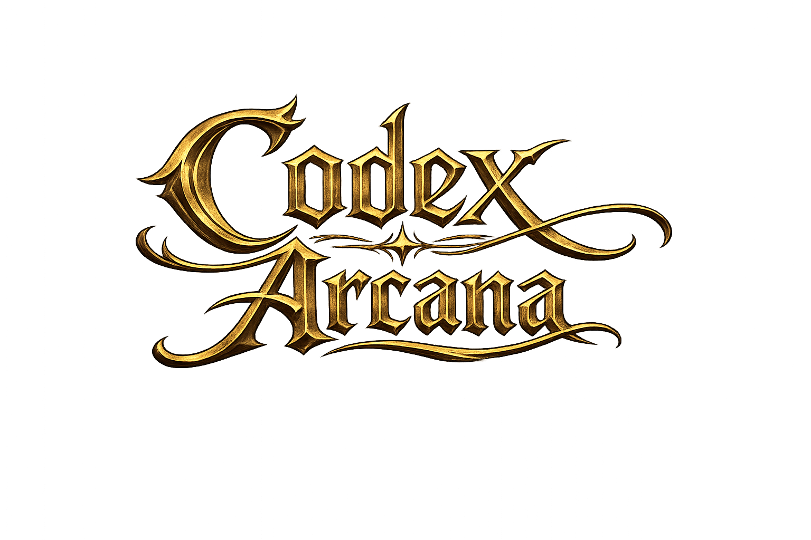
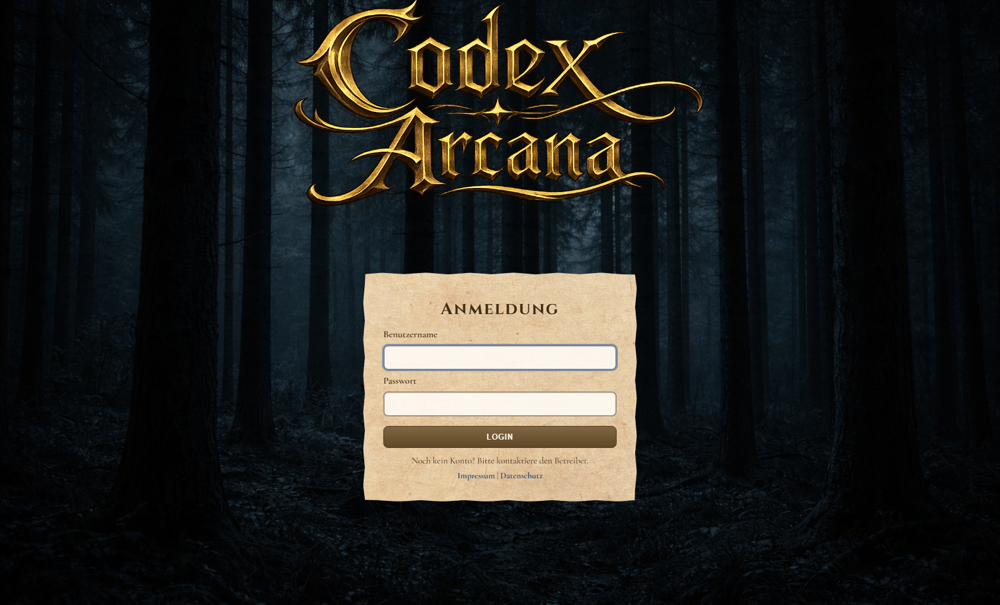
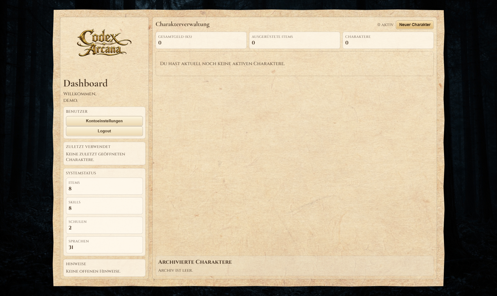
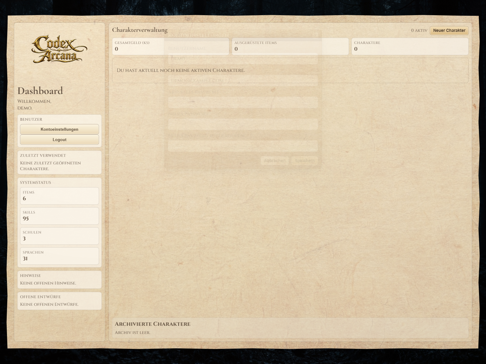

# Codex Arcana

Digitales Verwaltungssystem für das Pen-and-Paper-Rollenspiel **Arcane Codex**, umgesetzt mit Django.

## Überblick

Codex Arcana unterstützt Spielleitung und Spieler:innen bei der laufenden Charakterverwaltung:
- Dashboard mit aktiven Charakteren, Archiv und Entwürfen
- Phasenbasierte Charaktererstellung
- Regelberechnungen im Character Sheet (Attribute, Skills, Abwehr, Wunden, Ausrüstung)
- Ingame-Tools für Shop, Lernen, Tagebuch und Ressourcen
- Inline-Kontoeinstellungen direkt im Dashboard

## Technologie-Stack

- Python / Django
- PostgreSQL
- Django Templates + statische Assets (`static/`)

## Schnellstart

### Voraussetzungen

- Python 3.x
- PostgreSQL auf `localhost:5432` oder Docker

### Datenbank via Docker starten (optional)

```bash
docker compose up -d db
```

### App starten

```bash
python -m pip install -r requirements.txt
python manage.py migrate
python manage.py createsuperuser
python manage.py runserver
```

### Wichtige URLs

- Login: `http://127.0.0.1:8000/`
- Dashboard: `http://127.0.0.1:8000/dashboard/`
- Admin: `http://127.0.0.1:8000/admin/`

## Nutzeranleitung

### 1. Login und Dashboard

Nach dem Login gelangst du ins Dashboard. Dort kannst du:
- aktive Charaktere öffnen, archivieren und löschen
- archivierte Charaktere reaktivieren
- Entwürfe der Charaktererstellung fortsetzen
- neue Charaktere anlegen
- Kontoeinstellungen im Inline-Fenster bearbeiten

### 2. Charakter erstellen

Über **Neuer Charakter** startest du die phasenbasierte Erstellung.  
Entwürfe bleiben erhalten und können später fortgesetzt oder verworfen werden.

### 3. Character Sheet nutzen

Im Character Sheet stehen unter anderem bereit:
- abgeleitete Werte aus der Engine
- Inventar- und Ausrüstungsverwaltung
- Shop- und Lernfunktionen
- Tagebuch mit datierbaren Einträgen (inkl. Rückdatierung)
- Anpassung von Geld, Erfahrung und Schaden

### 4. Kontoeinstellungen

Im Dashboard links auf **Kontoeinstellungen** klicken.  
Im Inline-Fenster lassen sich ändern:
- Benutzername
- E-Mail
- Passwort (mit aktuellem Passwort und Bestätigung)

## UI-Assets (Symbole)

| Symbol | Vorschau |
|---|---|
| Logo |  |
| Tagebuch |  |
| Shop |  |
| Lernen |  |
| Würfel |  |
| Dashboard/Back |  |

## Screenshots

Die Screenshots liegen in `docs/screenshots/` und zeigen den aktuellen Nutzungsfluss.

### Login



Zweck:
- Einstiegspunkt für alle Nutzer:innen
- Authentifizierung vor Dashboard/Sheet

### Dashboard



Zweck:
- zentrale Übersicht über Charaktere, Status und Entwürfe
- Startpunkt für Charaktererstellung und Verwaltung

### Dashboard: Kontoeinstellungen (Inline-Fenster)



Zweck:
- schnelle Profiländerungen ohne Seitenwechsel
- Benutzername/E-Mail/Passwort in einem kompakten Workflow

## Projektstruktur

```text
codex_arcana/              Django-Projektkonfiguration (settings, urls, wsgi/asgi)
charsheet/                 Fachlogik (Modelle, Views, Admin, Forms, Engine)
charsheet/engine/          Regel-Engines
charsheet/templates/       Django-Templates
static/                    Projektweite statische Assets
docs/                      Projektdokumentation
```

## Dokumentation

Weiterführende Projektdokumentation:
- [`docs/setup.md`](docs/setup.md)
- [`docs/architecture.md`](docs/architecture.md)
- [`docs/models.md`](docs/models.md)
- [`docs/engine.md`](docs/engine.md)
- [`docs/routes.md`](docs/routes.md)
- [`docs/legal.md`](docs/legal.md)

## Rechtliches für Self-Hosting

Konfigurierbare Betreiberdaten per Umgebungsvariablen:
- `LEGAL_SITE_NAME`
- `LEGAL_OPERATOR_NAME` (Pflicht)
- `LEGAL_ADDRESS` (Pflicht)
- `LEGAL_EMAIL` (Pflicht)
- `LEGAL_PHONE` (optional)
- `LEGAL_RESPONSIBLE_PERSON` (optional)
- `LEGAL_REGISTER_ENTRY` (optional)
- `LEGAL_VAT_ID` (optional)
- `LEGAL_SUPERVISORY_AUTHORITY` (optional)

## Lizenz

Dieses Projekt steht unter der GNU General Public License v3.0. Siehe `LICENSE`.

Separate Drittlizenzen, z. B. fuer eingebundene Schriftarten unter `static/fonts/`, bleiben davon unberuehrt.
