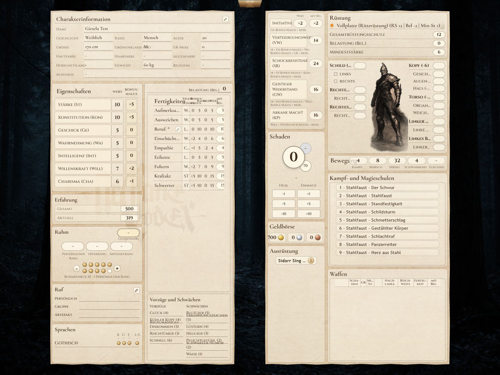
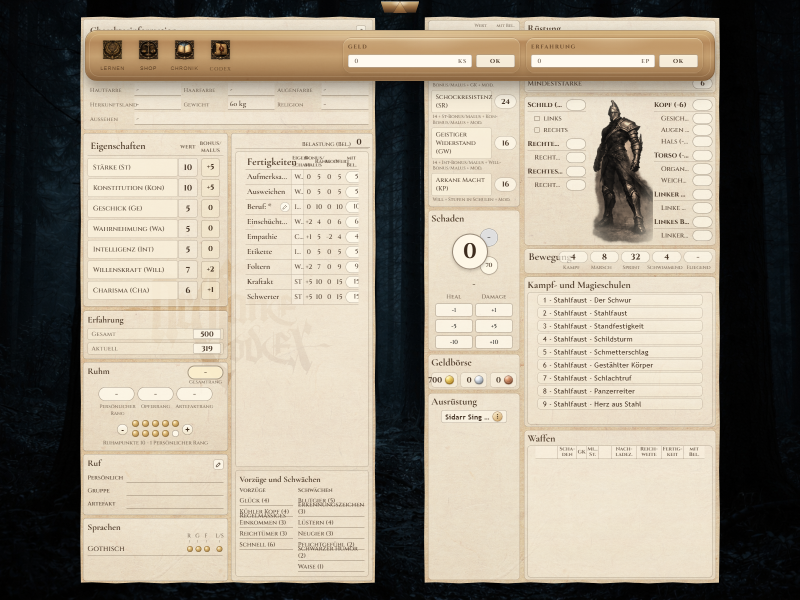
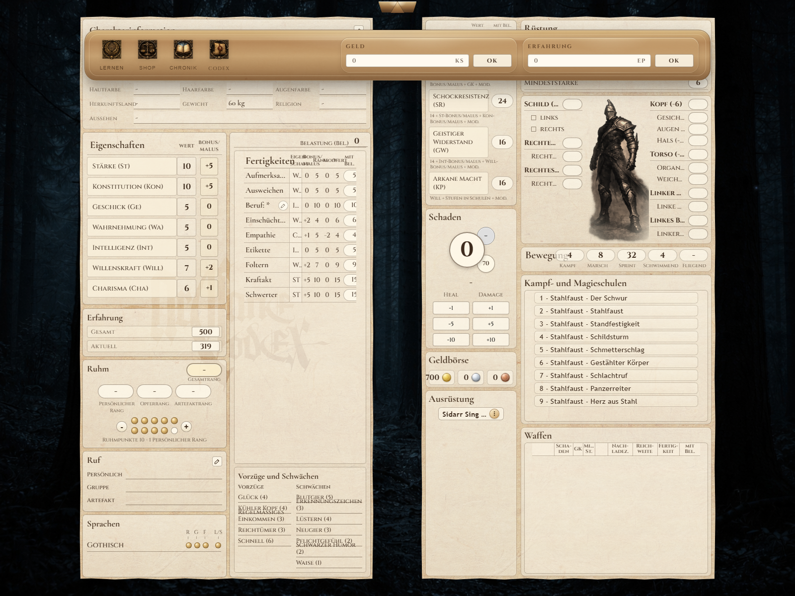
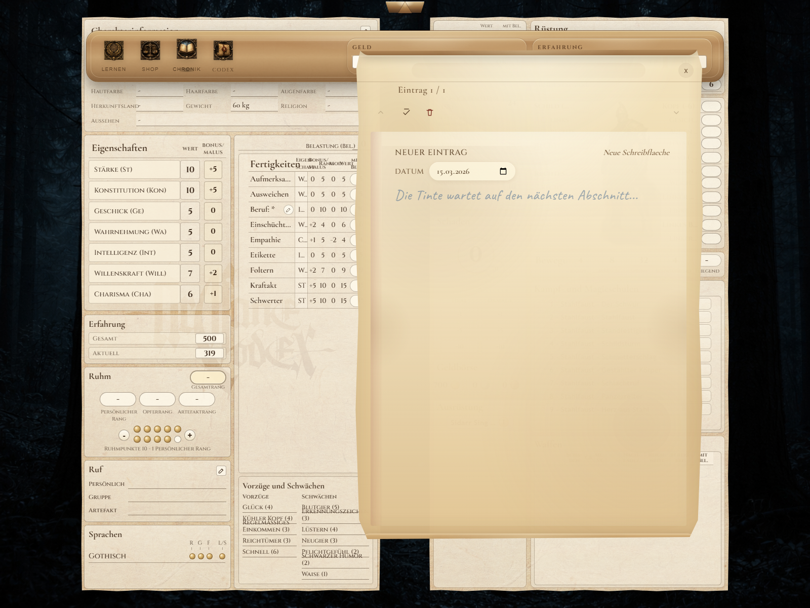

# Codex Arcana

Codex Arcana ist ein Django-basiertes Verwaltungssystem fuer das Pen-and-Paper-Rollenspiel **Arcane Codex**. Die Anwendung kombiniert klassische Datenpflege mit einer regelgetriebenen Character-Engine, damit ein Charakterbogen nicht nur Werte speichert, sondern spielrelevante Ableitungen konsistent aus dem aktuellen Zustand berechnet.

## Was das Projekt heute abdeckt

Der aktuelle Stand geht deutlich ueber einen einfachen Charakterbogen hinaus:

- Dashboard mit aktiven Charakteren, Archiv, Entwurfsverwaltung und Kontoeinstellungen
- mehrphasige Charaktererstellung mit persistenten Drafts
- Character Sheet mit vorbereitetem Template-Kontext
- Inventar, Ausruestung und qualitaetsabhaengige Itemwerte
- Lernen per EP-Ausgabe fuer Attribute, Skills, Sprachen und Schulen
- Shop mit Warenkorb, Preisberechnung und benutzerdefinierten Gegenstaenden
- persistentes Tagebuch pro Charakter mit JSON-Endpunkten fuer die UI
- Technik-, Spezialisierungs- und Modifikatorsystem fuer regelgetriebene Freischaltungen

## Technologie-Stack

- Python 3
- Django 5.2
- PostgreSQL 16
- Django Templates
- projektweite Assets in `static/`, app-spezifische Assets in `charsheet/static/`

## Schnellstart

### Voraussetzungen

- Python 3.x
- PostgreSQL auf `localhost:5432`
- alternativ Docker fuer die mitgelieferte Datenbank

### Datenbank per Docker starten

```bash
docker compose up -d db
```

### Anwendung starten

```bash
python -m pip install -r requirements.txt
python manage.py migrate
python manage.py createsuperuser
python manage.py runserver
```

### Wichtige URLs

- Login: `http://127.0.0.1:8000/`
- Dashboard: `http://127.0.0.1:8000/dashboard/`
- Admin: `http://127.0.0.1:8000/admin/`
- Character-Erstellung: `http://127.0.0.1:8000/character/new/`

## Einblicke

Die wichtigsten Ansichten sind hier als kompakte Galerie zusammengefasst. Ein Klick auf eine Miniatur oeffnet jeweils die groessere Version.

### Einstieg und Uebersicht

<table>
  <tr>
    <td align="center" valign="top">
      <a href="docs/screenshots/login.png">
        
      </a>
      <br>
      <strong>Login</strong>
      <br>
      Einstiegspunkt fuer die Anwendung.
    </td>
    <td align="center" valign="top">
      <a href="docs/screenshots/dashboard.png">
        
      </a>
      <br>
      <strong>Dashboard</strong>
      <br>
      Charaktere, Entwuerfe, Hinweise und Schnellaktionen an einem Ort.
    </td>
    <td align="center" valign="top">
      <a href="docs/screenshots/dashboard_account_settings.png">
        
      </a>
      <br>
      <strong>Kontoeinstellungen</strong>
      <br>
      Inline bearbeitbar ohne Seitenwechsel.
    </td>
  </tr>
</table>

### Character Sheet und Werkzeuge

<table>
  <tr>
    <td align="center" valign="top">
      <a href="docs/screenshots/character_sheet.png">
        
      </a>
      <br>
      <strong>Character Sheet</strong>
      <br>
      Zentrale Arbeitsansicht mit berechneten Werten und Statusdaten.
    </td>
    <td align="center" valign="top">
      <a href="docs/screenshots/character_sheet_shop.png">
        
      </a>
      <br>
      <strong>Shop</strong>
      <br>
      Kaufbare Items, Qualitaeten, Rabatt und Warenkorb in einem Fenster.
    </td>
    <td align="center" valign="top">
      <a href="docs/screenshots/character_sheet_learning.png">
        
      </a>
      <br>
      <strong>Lernen</strong>
      <br>
      EP-basierte Steigerung fuer Attribute, Skills, Sprachen und Schulen.
    </td>
  </tr>
  <tr>
    <td align="center" valign="top">
      <a href="docs/screenshots/character_sheet_diary.png">
        
      </a>
      <br>
      <strong>Tagebuch</strong>
      <br>
      Persistente Chronik mit datierbaren und fixierbaren Eintraegen.
    </td>
    <td colspan="2" valign="middle">
      <strong>Warum diese Galerie?</strong>
      <br><br>
      Die README soll schnell Orientierung geben, ohne beim Scrollen zu erschlagen. Deshalb sind die Ansichten hier als klickbare Miniaturen gruppiert:
      <br>
      zuerst der Einstieg in die App,
      <br>
      danach die eigentliche Arbeitsflaeche mit ihren wichtigsten Werkzeugen.
    </td>
  </tr>
</table>

## Anwendungstutorial

Dieses Tutorial beschreibt den aktuell moeglichen Hauptablauf mit dem bestehenden Funktionsumfang.

### 1. Anmelden

1. Oeffne `http://127.0.0.1:8000/`.
2. Melde dich mit deinem Benutzerkonto an.
3. Nach erfolgreichem Login landest du automatisch im Dashboard.

### 2. Dashboard verstehen

Im Dashboard findest du mehrere Bereiche mit klaren Aufgaben:

- **Benutzerbereich** mit Logout und Kontoeinstellungen
- **Zuletzt verwendet** fuer schnellen Wiedereinstieg in bereits geoeffnete Charaktere
- **Systemstatus** mit globalen Datenmengen wie Items, Skills, Schulen und Sprachen
- **Hinweise** fuer unverteilte EP, offenen Schaden oder andere auffaellige Zustaende
- **Offene Entwuerfe** fuer angefangene Charaktererstellungen
- **Charakterverwaltung** fuer aktive Charaktere mit Oeffnen-, Archivieren- und Loeschen-Aktion
- **Archiv** fuer stillgelegte Charaktere, die spaeter reaktiviert werden koennen

### 3. Einen neuen Charakter anlegen

1. Klicke im Dashboard auf **Neuer Charakter**.
2. Die Charaktererstellung oeffnet sich in einem Fenster ueber dem Dashboard.
3. Waehle die Grunddaten und arbeite dich durch die vier Phasen.
4. Wenn du unterbrichst, bleibt der Entwurf erhalten und erscheint spaeter unter **Offene Entwuerfe**.
5. Beim Finalisieren erzeugt die Anwendung den echten Charakter mit allen zugehoerigen Daten.

### 4. Einen bestehenden Charakter oeffnen

1. Wechsle in der Tabelle **Charakterverwaltung** zum gewuenschten Charakter.
2. Klicke auf **Oeffnen**.
3. Das Character Sheet zeigt dir den kompletten aktuellen Zustand des Charakters samt berechneter Werte.

### 5. Im Character Sheet arbeiten

Das Character Sheet ist die wichtigste Arbeitsoberflaeche der App. Dort laufen aktuell mehrere Bereiche zusammen:

- Attribut- und Fertigkeitsanzeige mit regelbasierten Ableitungen
- Vorteile, Nachteile, Sprachen, Schulen und Techniken
- Waffen-, Ruestungs- und Inventarverwaltung
- Geld-, EP-, Schaden- und Ruhmverwaltung
- Lernfenster, Shop und Tagebuch

### 6. Charakterinformationen direkt pflegen

Im Character Sheet koennen die Stammdaten des Charakters direkt aktualisiert werden. Dazu gehoeren unter anderem:

- Name
- Geschlecht
- Alter, Groesse und Gewicht
- Haut-, Haar- und Augenfarbe
- Herkunft, Religion und Erscheinungsbild

Die Eingaben werden ueber ein Inline-Formular gespeichert, ohne dass ein separater Admin-Bereich noetig ist.

### 7. Schaden, Geld und Erfahrung anpassen

Fuer die laufende Spielsitzung sind mehrere Direktaktionen vorhanden:

- Schaden erhoehen oder heilen
- Geld anpassen
- aktuelle und gesamte Erfahrung veraendern
- persoenliche Ruhmpunkte verwalten

Gerade Schaden ist wichtig, weil die Engine daraus automatisch Wundstufen und moegliche Abzuege ableitet.

### 8. Inventar und Ausruestung nutzen

Im Inventar lassen sich Gegenstaende je nach Typ unterschiedlich behandeln:

- Waffen, Ruestungen und Schilde koennen an- oder abgelegt werden
- Verbrauchsgegenstaende koennen verbraucht werden
- Items lassen sich einzeln oder stackweise entfernen
- Qualitaeten beeinflussen Preise und teilweise auch Werte

Ausgeruestete Waffen und Ruestung wirken direkt auf die berechneten Kampf- und Belastungswerte.

### 9. Lernen mit Erfahrungspunkten

Der Lernbereich dient dazu, aktuelle EP in Fortschritt umzuwandeln.

Der derzeitige Workflow ist:

1. Lernfenster oeffnen.
2. Zielwerte fuer Attribute, Skills, Sprachen oder Schulen setzen.
3. Kosten indirekt ueber die hinterlegte Lernlogik pruefen lassen.
4. Aenderungen anwenden.
5. Die App reduziert die aktuellen EP und aktualisiert die betroffenen Charakterdaten atomar.

Wenn nicht genug aktuelle EP vorhanden sind oder eine Obergrenze verletzt wird, lehnt die Anwendung den Vorgang mit einer passenden Rueckmeldung ab.

### 10. Den Shop verwenden

Der Shop unterstuetzt zwei typische Faelle:

- vorhandene Basis-Items mit Qualitaet und Menge kaufen
- neue benutzerdefinierte Shop-Items anlegen

Der Kaufablauf ist aktuell so gedacht:

1. Item(s) auswaehlen.
2. Menge und gegebenenfalls Qualitaet festlegen.
3. Optional Rabatt eintragen.
4. Warenkorb kaufen.
5. Die App prueft Geld, Mengenregeln und Stackbarkeit und aktualisiert danach Geldbeutel und Inventar in einer Transaktion.

### 11. Das Tagebuch fuehren

Das Tagebuch ist inzwischen serverseitig persistent und nicht mehr nur eine lokale Browserfunktion. Der aktuelle Ablauf:

1. Im Character Sheet den Tagebuchbereich oeffnen.
2. Einen Text in den aktuellen offenen Eintrag schreiben.
3. Optional ein Datum setzen.
4. Den Eintrag speichern oder fixieren.
5. Fixierte Eintraege koennen spaeter wieder in den Bearbeitungsmodus geholt oder geloescht werden.

Die Anwendung sorgt serverseitig dafuer, dass die Reihenfolge stabil bleibt und immer genau ein leerer Eintrag als naechste Schreibflaeche vorhanden ist.

### 12. Charaktere archivieren oder reaktivieren

Nicht mehr aktiv gespielte Charaktere muessen nicht geloescht werden:

1. Im Dashboard bei einem aktiven Charakter auf **Archivieren** klicken.
2. Der Charakter verschwindet aus der aktiven Tabelle und erscheint im Archiv.
3. Ueber **Reaktivieren** kann er jederzeit wieder in die aktive Liste verschoben werden.

## Arbeitsweise aus Nutzersicht

### Dashboard

Nach dem Login landet man im Dashboard. Dort werden aktive Charaktere, archivierte Charaktere und laufende Erstellungsentwuerfe getrennt dargestellt. Zusaetzlich blendet das Dashboard Warnungen ein, zum Beispiel bei unverteilten EP oder aktuellem Schaden.

### Charaktererstellung

Die Erstellung ist als Draft-Workflow ueber vier Phasen umgesetzt. Der Zustand jeder Phase wird in einem JSON-Feld gespeichert und kann spaeter fortgesetzt oder verworfen werden. Erst beim Finalisieren erzeugt die Anwendung die eigentlichen Charakter-, Attribut-, Skill-, Sprach- und Schuldatensaetze.

### Character Sheet

Das Character Sheet ist die zentrale Arbeitsflaeche des Projekts. Die View berechnet nicht mehr direkt im Template, sondern nutzt `build_character_sheet_context(...)`, um die Anzeige- und Interaktionsdaten fuer Attribute, Skills, Vorteile/Nachteile, Ausruestung, Shop, Lernen und Tagebuch vorzubereiten.

### Ingame-Tools

Das Sheet enthaelt mehrere zusammenhaengende Werkzeuge:

- Shop mit Warenkorb, Qualitaeten und optionaler Rabattberechnung
- Lernfenster fuer EP-basierte Steigerungen
- Tagebuch mit editierbaren und fixierten Eintraegen
- Direktanpassung von Geld, Erfahrung, Schaden und Ruhmpunkten

## Projektstruktur

```text
codex_arcana/                  Django-Projektkonfiguration
charsheet/
  models/                      fachlich gruppierte Domain-Modelle
  engine/                      Character- und Item-Berechnungen
  templates/charsheet/         Dashboard, Character Sheet, Partials
  learning.py                  EP-Lernworkflow
  shop.py                      Shop-Logik und Warenkorb-Kauf
  sheet_context.py             vorbereiteter Kontext fuer das Character Sheet
  view_utils.py                kleine Formatierungshelfer fuer Views/UI
static/                        globale CSS-, JS-, Bild- und Font-Assets
docs/                          technische Projektdokumentation
```

## Technische Neuerungen gegenueber dem frueheren Stand

Die Dokumentation wurde auf den aktuellen Code angepasst. Die wichtigsten strukturellen Aenderungen sind:

- `charsheet/models.py` wurde in ein Modellpaket unter `charsheet/models/` aufgeteilt.
- `CharacterEngine` ist fachlich breiter geworden und arbeitet mit Hilfsmodulen fuer Kampf, Ausruestung und Progression.
- Das Character Sheet bezieht seinen Datenbestand aus `sheet_context.py` statt aus umfangreicher Template-Logik.
- Tagebuch, Shop und Lernen sind als eigene Workflow-Module ausgelagert.
- Technik- und Spezialisierungsdaten wurden deutlich erweitert und sind jetzt ein zentraler Teil des Regelmodells.

## Weiterfuehrende Dokumentation

- [`docs/README.md`](docs/README.md)
- [`docs/setup.md`](docs/setup.md)
- [`docs/architecture.md`](docs/architecture.md)
- [`docs/models.md`](docs/models.md)
- [`docs/engine.md`](docs/engine.md)
- [`docs/routes.md`](docs/routes.md)
- [`docs/legal.md`](docs/legal.md)

## Rechtliche Angaben fuer Self-Hosting

Die oeffentlichen Seiten `Impressum` und `Datenschutz` lesen ihre Betreiberdaten aus `LEGAL_INFO` in `codex_arcana/settings.py`. Diese Werte koennen ueber Umgebungsvariablen gesetzt werden:

- `LEGAL_SITE_NAME`
- `LEGAL_OPERATOR_NAME`
- `LEGAL_ADDRESS`
- `LEGAL_EMAIL`
- `LEGAL_PHONE`
- `LEGAL_RESPONSIBLE_PERSON`
- `LEGAL_REGISTER_ENTRY`
- `LEGAL_VAT_ID`
- `LEGAL_SUPERVISORY_AUTHORITY`

## Lizenz

Das Projekt steht unter der GNU General Public License v3.0. Details stehen in `LICENSE`.

Separate Drittlizenzen, zum Beispiel fuer eingebundene Schriftarten unter `static/fonts/`, bleiben davon unberuehrt.


